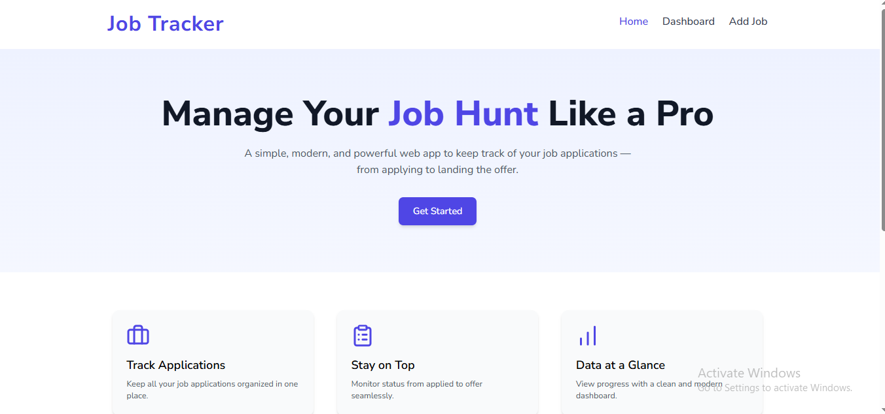
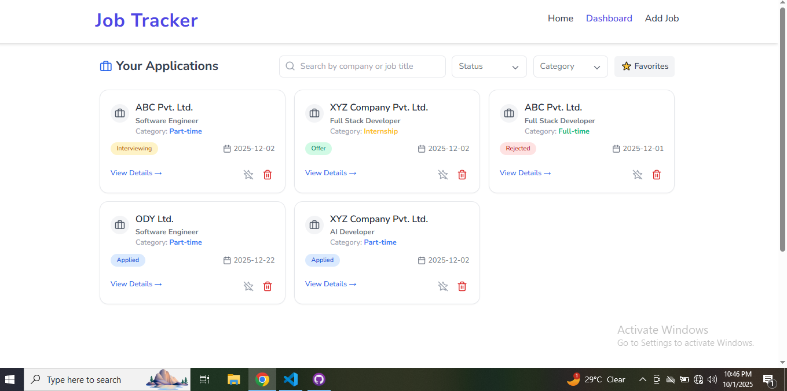
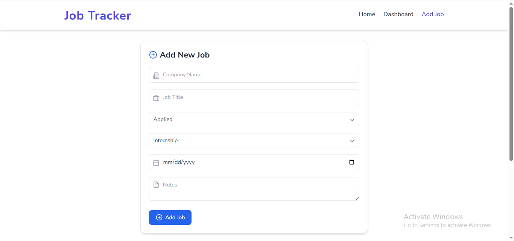

# 📌 Job Application Tracker

A modern and responsive **Job Application Tracker App** built with **React, Redux Toolkit, TailwindCSS, and Framer Motion**.
This app helps users manage and track their job applications in one place with filtering, searching, and favorites support.

---

## 🚀 Features

* 🔹 **Add Job Applications** – Save company name, job title, status, category, date, and notes.
* 🔹 **Edit & Delete Jobs** – Update details or remove applications anytime.
* 🔹 **Search & Filter** – Filter jobs by status (Applied, Interviewing, Offer, Rejected) and category (Internship, Full-time, Part-time, Freelance).
* 🔹 **Favorites** – Mark important jobs as favorites ⭐ and view them separately.
* 🔹 **Responsive Design** – Fully responsive UI with a modern header, homepage, and dashboard.
* 🔹 **Animations** – Smooth transitions using **Framer Motion**.
* 🔹 **Persistent Storage** – Data is saved to `localStorage`, so jobs remain even after refresh.
* 🔹 **Export & Import JSON** – Export your job applications to a `.json` file and restore them anytime.

---

## 🛠 Tech Stack

* ⚛️ **React 18**
* 🗂 **Redux Toolkit** (State Management)
* 🎨 **Tailwind CSS** (Styling)
* 🎬 **Framer Motion** (Animations)
* 📦 **Lucide Icons** (UI Icons)
* 💾 **LocalStorage** (Persistent Storage)

---

## 📷 Screenshots

### 🏠 Home Page

Modern landing page with animations.



### 📊 Dashboard

* View all job applications.
* Apply filters, search, and view favorites.



### ➕ Add Job Form

* Add company details, category, status, and notes.



---

## ⚡ Installation

1. Clone the repository

   ```bash
   git clone https://github.com/Aashra55/Elevvo-Pathways-Internship.git
   cd job-tracker
   ```

2. Install dependencies

   ```bash
   npm install
   ```

3. Run the app

   ```bash
   npm start
   ```

---

## 📂 Project Structure

```
src/
 ├── components/     # Reusable UI components
 ├── pages/          # Page components (Home, Dashboard, AddJob, JobDetails)
 ├── store/          # Redux store and slices
 ├── App.js          # Main app component
 └── index.js        # Entry point
```

---

## 🔮 Future Enhancements

* 📌 Authentication (Login/Signup with Firebase or JWT).
* 📌 Cloud Database (MongoDB / Firebase Firestore instead of localStorage).
* 📌 Resume Upload Feature.
* 📌 Calendar Integration (Interview Reminders).
* 📌 Dark Mode Theme.

---

## 👩‍💻 Author

Developed by **Aashra Saleem** ✨
Frontend Developer | React | Next.js | TailwindCSS
