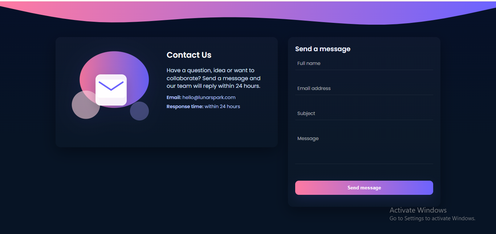

# Responsive Contact Form

## 📌 Description
A clean and responsive **Contact Form** built with **HTML, CSS, and JavaScript**.  
The form is designed to work seamlessly across all screen sizes (desktop, tablet, and mobile).  

---

## ✨ Features
- Input fields for:
  - Full Name  
  - Email Address  
  - Subject  
  - Message  
- Submit button with clear visibility  
- Clean layout with proper spacing between inputs  
- Responsive design (works on phones and desktops)  
- **Bonus:** Basic JavaScript validation for required fields and valid email format  

---

## Screenshots

---

## 🛠️ Tools & Technologies
- HTML  
- CSS  
- JavaScript  

---

## 📂 Project Structure
