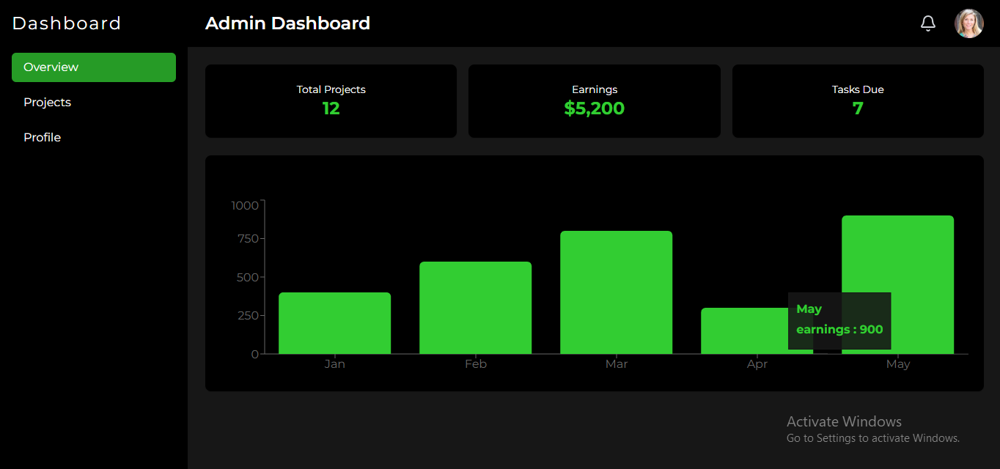
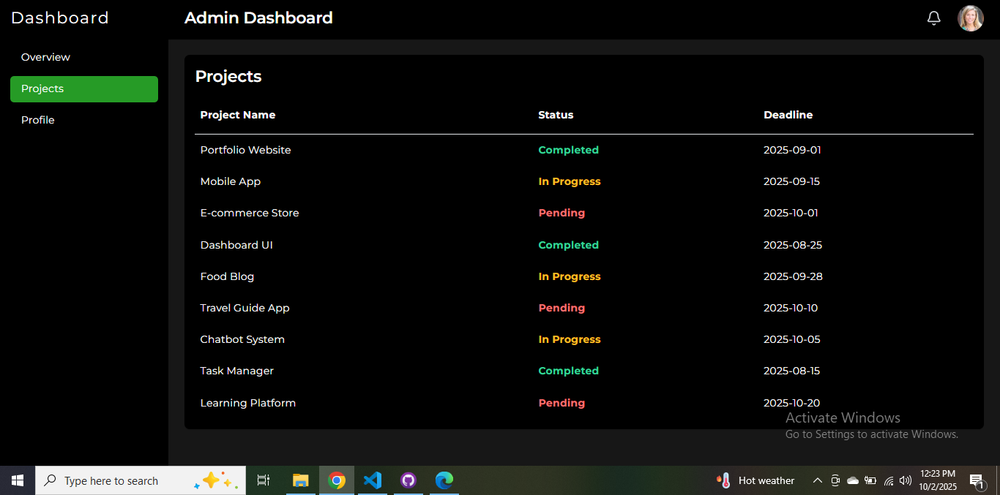
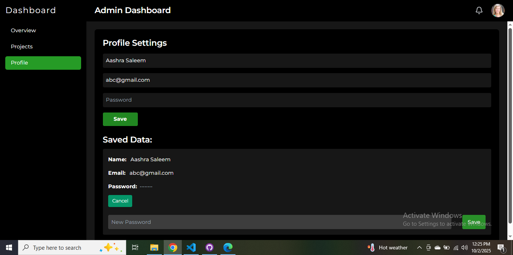

# 📊 Freelance Admin Dashboard

A **multi-page admin dashboard** built with **React, Tailwind CSS, and Framer Motion** for smooth animations.  
This dashboard is designed for a **fictional freelance client** and includes an **Overview page**, **Profile Page** and a **Projects page** with a clean, component-based structure.  

---

## ✨ Features
- **Overview Page**
  - Summary cards (Total Projects, Earnings, Tasks Due)
  - Basic statistics and charts
- **Projects Page**
  - List of projects in table layout
  - Includes project name, status, and deadline
- **Profile Page**
  - Profile settings and user details
- **Component-Based Architecture**
  - Reusable UI components for tables, headers, etc.
- **Responsive Design**
  - Works seamlessly across desktop, tablet, and mobile
- **Animations**
  - Smooth transitions powered by **Framer Motion**
- **Modern Styling**
  - Tailwind CSS with custom colors and shadows
---

## 📸 Screenshot

## Overview




## Projects Section



## Profile Section



---

## 🛠️ Tech Stack
- **Frontend:** React 
- **Styling:** Tailwind CSS
- **Animations:** Framer Motion
- **Icons:** Lucide React / Heroicons
- **State Management:** React Hooks

---

## 🚀 Getting Started

```bash
# Clone repository
git clone https://github.com/Aashra55/Elevvo-Pathways-Internship.git
cd Elevvo-Pathways-Internship/Frontend-Web-Development/Level-3/admin-dashboard

# Install dependencies
npm install
# or
yarn install

# Run development server
npm start         

```

---

## 🤝 Contributing
Contributions are welcome! If you’d like to improve the design, fix bugs, or add features, feel free to fork and open a pull request.

## 📜 License
This project is licensed under the MIT License – you’re free to use and modify it.

## 📬 Contact

Project by **Aashra Saleem**
🔗 GitHub: [Aashra55](https://github.com/Aashra55)
📂 Repo: [Admin Dashboard](https://github.com/Aashra55/Elevvo-Pathways-Internship/tree/main/Frontend-Web-Development/Level-3/dashboard)

