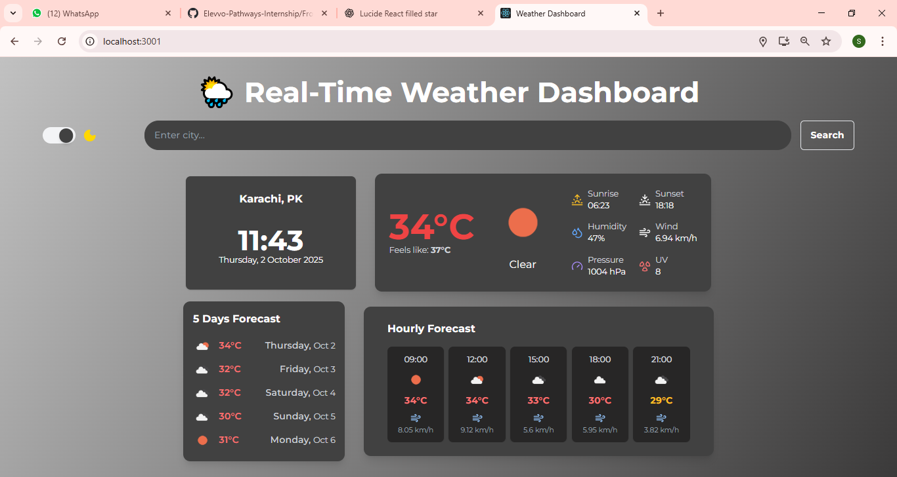
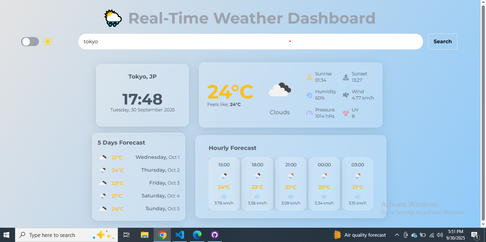

# 🌦️ Weather Dashboard

A responsive **Weather Dashboard** built with **React**, powered by **OpenWeatherMap API**, and styled with **Lucide React Icons**.
It comes with **light/dark themes**, real-time weather updates, and a clean modern UI.

---

## 🚀 Features

* 🌍 Search weather by city name
* 🕒 Current weather with temperature, humidity, wind speed, and conditions
* 📅 Daily and hourly forecast view
* 🎨 Toggle between **Dark Mode** and **Light Mode**
* 📱 Fully responsive for desktop, tablet, and mobile
* ✨ Clean and minimal UI with Lucide React icons

---

## 🛠️ Tech Stack

* **React.js** – Frontend framework
* **Lucide React** – Modern icons
* **OpenWeatherMap API** – Weather data
* **Tailwind CSS** – Styling (if used, adjust accordingly)

---

## 📂 Project Structure

```
├── public
│   └── index.html
├── src
│   ├── components/   # Reusable UI components
│   ├── App.jsx
│   ├── index.js
│   └── WeatherDashboard.jsx    # Home page of App
└── package.json
```

---

## ⚡ Getting Started

### 1. Clone the repo

```bash
git clone https://github.com/Aashra55/Elevvo-Pathways-Internship.git
cd Elevvo-Pathways-Internship/Frontend-Web-Development/Level-3
cd weather-dashboard
```

### 2. Install dependencies

```bash
npm install
# or
yarn install
```

### 3. Get API Key

* Create an account on [OpenWeatherMap](https://openweathermap.org/)
* Generate your free API key
* Create a `.env` file in the root directory and add:

```
REACT_APP_WEATHER_API_KEY=your_api_key_here
```

### 4. Run the app

```bash
npm start
# or
yarn start
```

---

## 🎨 Screenshots

## Dark Theme



## Light Theme



---

## 🌐 Deployment

You can deploy the project easily on:

* **Vercel**
* **Netlify**
* **GitHub Pages**

---

## 🤝 Contributing

Contributions, issues, and feature requests are welcome!
Feel free to open a PR or report a bug.

---

## 📜 License

This project is **MIT licensed**.

---

## 🙌 Acknowledgements

* [React.js](https://reactjs.org/)
* [Lucide React](https://lucide.dev/)
* [OpenWeatherMap](https://openweathermap.org/)
